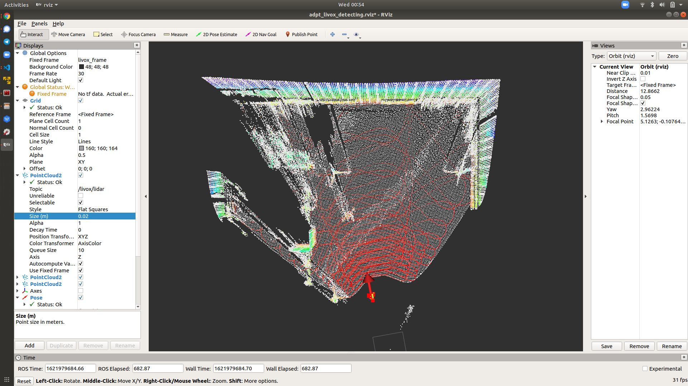

# Livox lidar object detection

The objective of this package is to provide an object detection solution based on Livox Lidar. In this package, (i) the first few (80) lidar frames will be integrated and transformed into a KDtree-Map. (ii) Each point in the new frame will find its nearest neighbor(NN) points in KD-map. (iii)For those points that there is no NN point found in KD-Map, it will be clustered and then treat each cluster as a tracking target.


This project is under update. Thanks for your reading.

 

## Summary

TO DO

## Installation

TO DO

## Run it

```
roslaunch object_detection adpt_detection.launch
```
 
